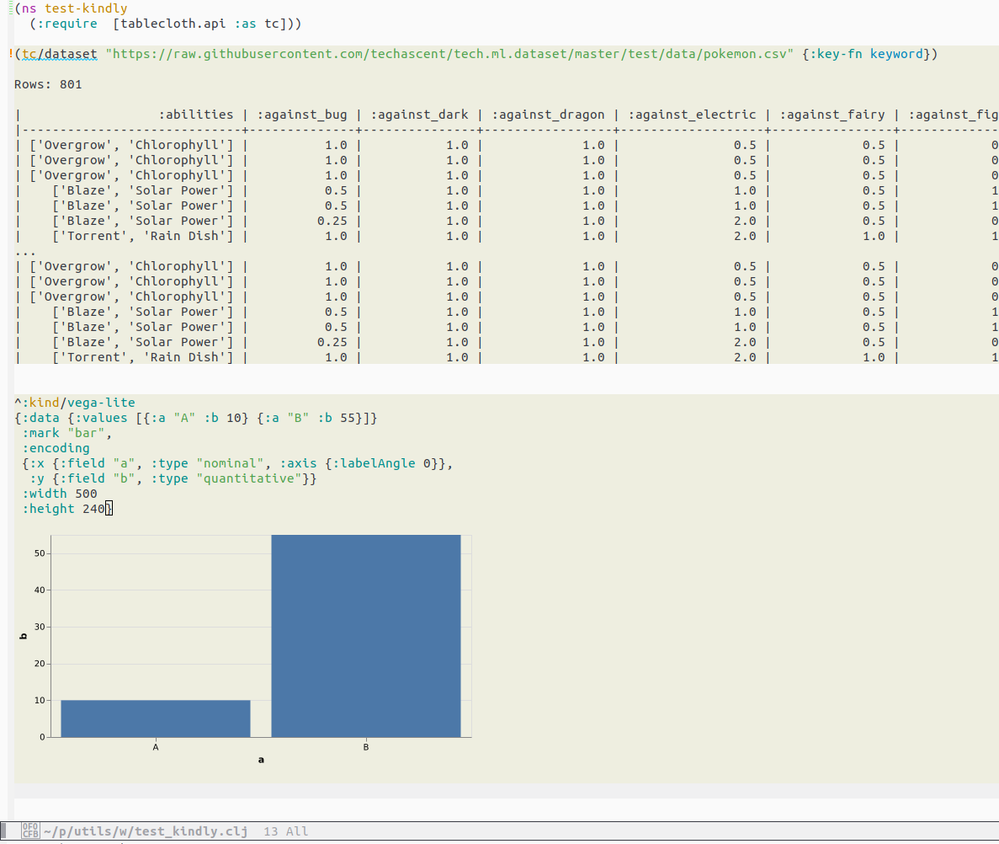

# Kindly-Clj Emacs Package

## Overview

The **Kindly-Clj** Emacs package enhances your Clojure development experience by providing visualizations for Clojure code. It leverages annotations as defined by the
[kindly library](https://github.com/scicloj/kindly). Currently only the following kinds are supported:

- `:kind/dataset`
- `:kind/vega-lite`

The processing is done by a companion Clojure library. The **kindly-emacs.kindly-emacs/kindly-plot** function generates visual representations of evaluated Clojure forms.

## Requirements

- [parseedn](https://github.com/clojure-emacs/parseedn): A Clojure library for parsing EDN (extensible data notation).
- requires Emacs built with SVG support.

## Screenshots

Emacs buffer with two visualised forms:


## Installation

I've not yet bundled this as an Emacs pakckage, so manual installation is currently required. The elisp code can be found in kindly-emacs.el

Make sure to install the required emacs-lisp library, `parseedn`, before using the Kindly-Clj package.

```emacs-lisp
(require 'parseedn)
```

## Loading Kindly-Clj

Add the following to your Emacs configuration file to load the Kindly-Clj package:

```emacs-lisp
(require 'kindly-clj)
```

## Integration with CIDER

To ensure that CIDER loads the required Clojure library, you can use a `.dir-locals.el` file in your project. Add the following content to your project's `.dir-locals.el` file:

```emacs-lisp
((clojure-mode
  (cider-clojure-cli-global-options . "-A:kindly-emacs")
  (cider-clojure-cli-parameters . "-A:kindly-emacs")))
```

## Features

### Visualizing Code

*   **`kindly-clj-visualise-last-sexp`**: Visualize the last sexp in the current buffer.
*   **`kindly-clj-visualise-region`**: Visualize the selected region in the buffer.
*   **`kindly-clj-visualise-defun-at-point`**: Visualize the Clojure defun at point.

## Customization

### Faces

*   **`kindly-clj-highlight-face`**: Face for previewed forms.

### Keymap

The `kindly-clj-overlay-keymap` is active in kindly-clj overlays (highlighted regions). That means that within a form that has already been visiualised, you can use `C-c C-c` to regenerate the visualization at point.

# Usage

Once the package is loaded, you can use the provided functions to visualize Clojure code in your Emacs buffer. Use the defined keymap for quick interactions.

# Contributing

Feel free to contribute to the project by submitting issues or pull requests. Contributions are welcome!

# License

This project is licensed under the [MIT License](LICENSE).
